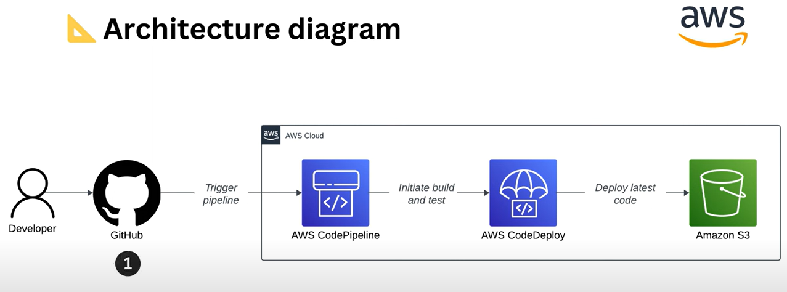
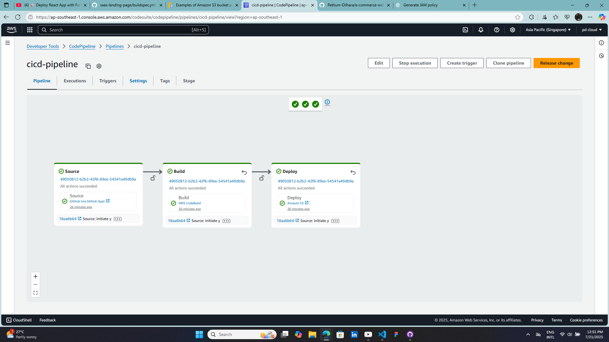
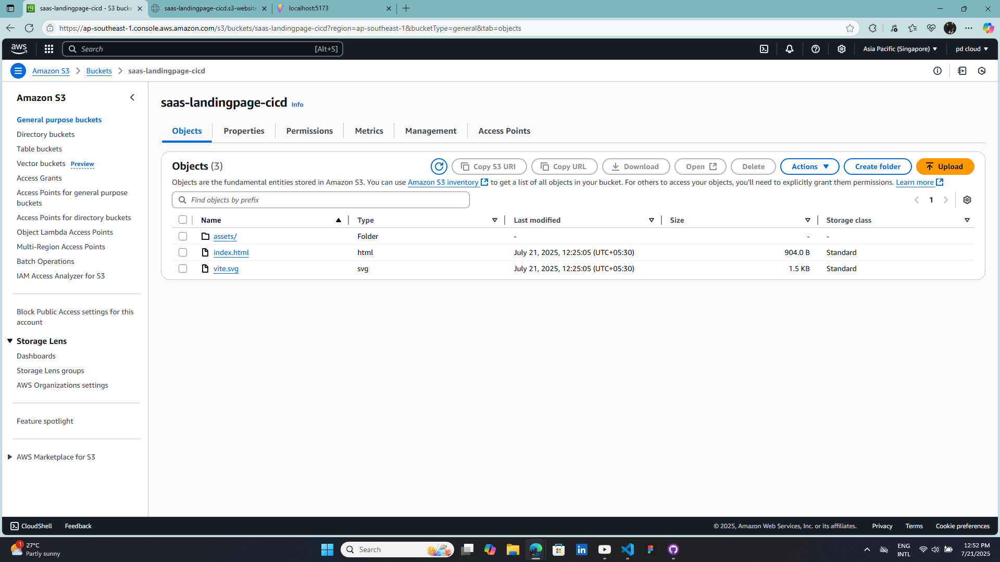

# 🚀 CI/CD Pipeline with AWS CodePipeline and S3 Bucket



This project demonstrates how to build a **fully automated CI/CD pipeline** using **AWS CodePipeline**, **CodeBuild**, and **S3 Bucket** for hosting a static website. Whenever you push updates to your GitHub repository, the pipeline automatically builds and deploys the content to your S3 bucket.

## 📁 Project Structure
```bash
project-root/
├── buildspec.yml
├── index.html
├── website/
│   ├── index.html
│   └── assets/
│       └── ...
└── README.md
```
## 🔧 Technologies & AWS Services Used

AWS CodePipeline – for automating the CI/CD process.
AWS CodeBuild – to build the application before deployment.
Amazon S3 – to host the static website.
GitHub – as the source control and trigger point.

## 🛠️ Setup & Deployment

1. Create an S3 Bucket
    Enable static website hosting.
    Make objects publicly readable (optional for public sites).
    Allow CodePipeline and CodeBuild access to S3.
2. Configure CodeBuild
    Include a buildspec.yml file:

```yaml
version: 0.2
phases:
  build:
    commands:
      - echo "Build phase - you can install dependencies here"
artifacts:
  files:
    - '**/*'
```

4. Create CodePipeline
   Connect to your GitHub repo.
   Use CodeBuild for the build stage.
   Deploy artifacts to your S3 bucket.


## 💻 CI/CD Flow Diagram

Push code to GitHub.
CodePipeline gets triggered.
CodeBuild compiles/builds (if needed).
Final artifacts deployed to S3 bucket.
Website automatically updated.

## ✅ CodePipeline Success


## ✅ AWS S3 Bucket


🧑‍💻 Author
Pathum Dilhara
GitHub - https://github.com/Pathum-Dilhara
LinkedIn - www.linkedin.com/in/dilhara2001


# React + Vite

This template provides a minimal setup to get React working in Vite with HMR and some ESLint rules.

Currently, two official plugins are available:

- [@vitejs/plugin-react](https://github.com/vitejs/vite-plugin-react/blob/main/packages/plugin-react/README.md) uses [Babel](https://babeljs.io/) for Fast Refresh
- [@vitejs/plugin-react-swc](https://github.com/vitejs/vite-plugin-react-swc) uses [SWC](https://swc.rs/) for Fast Refresh
